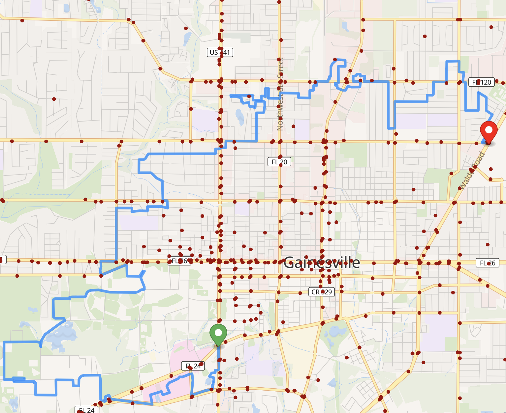
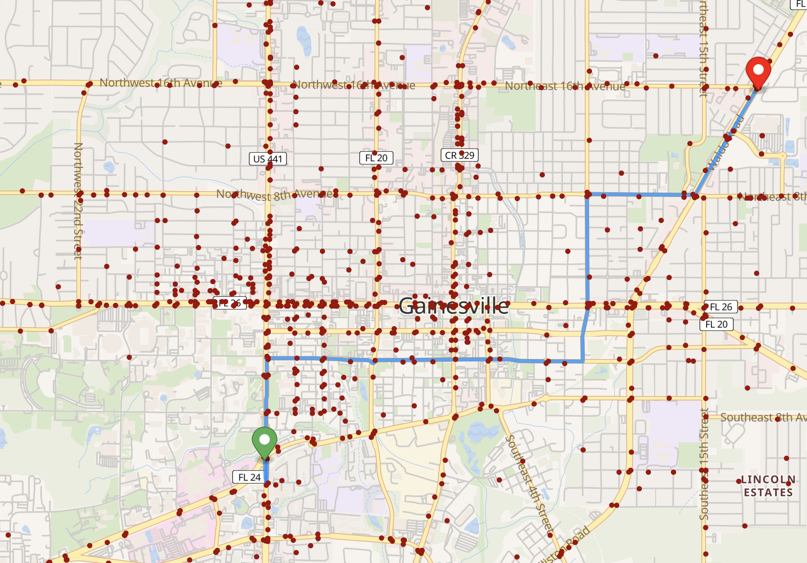

# Crashout
full-stack navigation service that takes traffic safety into account

(slightly outdated) project video: https://youtu.be/Y9xD4Ua34Tw?si=Rwu6F4CxJfPYHpED

## Usage guide
### regular user
- visit the website
- click two points
  - the first one is the starting point and the second one is the ending point
- select your desired routing algorithm and cost mechanism
- click find routes
- enjoy
### server hoster
- `git clone` the project
- `cd` to the root directory
- run `docker compose up`
- once containers are done building, the project should be at localhost:8080 (yes, it's really that simple)

## How it works
### frontend
- very simple, barebones javascript/html/css
- uses `maplibregl` and `pmtiles` for map rendering
- allows user to select two points, method, and shortest/fastest
  - sends this as a body to our backend API, which returns a path and time taken
- renders path on map and renders time taken in menu
- also allows user to toggle view of crash data to inspect route safety

### backend
- nginx is the proxy in front of everything
  - this handles serving pmtiles, static files and forwarding api requests to the router
- pather, the router, is a minimal c++ http server + graph parser + graph traversal implementation
- docker is used as a data processing pipeline
  - data-dl fetches raw gainesville data (crash data and bounded map)
    - crash data is used in geo-convert, then tippecanoe to render the traffic crashes
    - bounded map is used in tilemaker to render the actual map
    - both data are used to build the routing graph (for pather) with pathmaker
  - style-dl fetches the map style for rendering

## Examples
### safest route

note how the route has many twists and turns, but examining the path it takes shows that it is fairly far away from most traffic crashes
### fastest route

this route looks more like what you would get from a regular mapping service, which is expected
